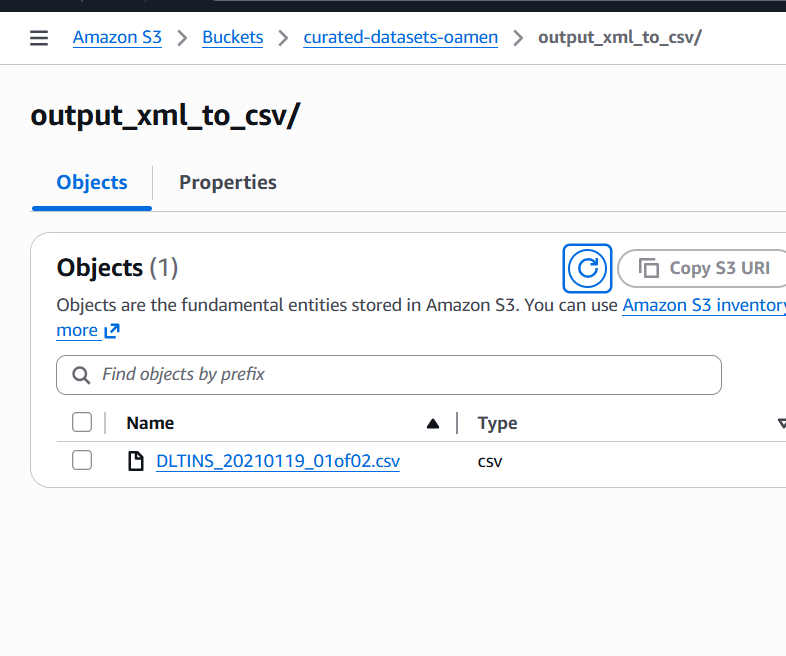

# xml_to_csv_data_processor

## About
This repo downloads xml files from custom links, parses and converts them to csv files. These files are transformed with pandas, written to local csv files then uploaded to s3 with fssepc

## How to run
1. Pull repo into local env
2. Set up poetry
```bash
poetry shell
poetry install --no-root
```
Set your python interpreter to the poetry venv path

3. Run the static tests
```bash
poetry run flake8 scripts
poetry run pydocstyle scripts
poetry run ruff check
```

3. Generate AWS secrets and bucket

4. Run the files in the following order

- To download the first xml, extract the required file download links, download, and extract the zipped files from those links
```bash 
poetry run python scripts/download_xml_files.py
```

- To convert the XML files into local CSV files that can be transformed
```bash 
poetry run python scripts/xml_to_csv_processor.py
```

- To read the local csv files, transform, write to s3 with fsspec
```bash 
poetry run python scripts/csv_data_processor.py
```

5. View data on s3 bucket


## Resources
https://pypi.org/project/python-dotenv/

https://stackoverflow.com/questions/29596584/getting-a-list-of-xml-tags-in-file-using-xml-etree-elementtree

https://www.geeksforgeeks.org/python/convert-xml-to-csv-in-python/

https://www.tutorialspoint.com/article/python-program-to-read-and-printing-all-files-from-a-zip-file

https://www.geeksforgeeks.org/python/unzipping-files-in-python/

https://www.zyte.com/learn/a-practical-guide-to-xml-parsing-with-python/


